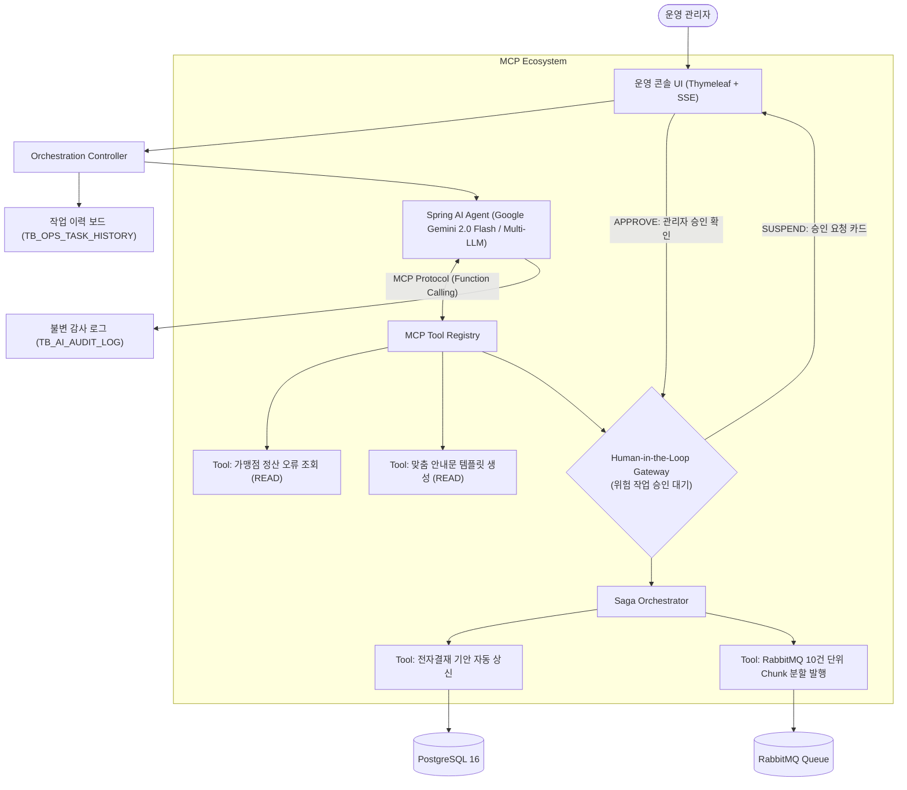

# 🚀 AutoOps-MCP: 자율형 백엔드 운영 오케스트레이션 플랫폼
> **Autonomous Backend Operations Orchestrator powered by Spring Boot 3.4 & Spring AI (MCP Standard)**

[](https://openjdk.org/)
[](https://spring.io/projects/spring-boot)
[](https://spring.io/projects/spring-ai)
[](https://www.postgresql.org/)
[](https://www.rabbitmq.com/)
[]()

---

## 📌 1. 프로젝트 개요 (Executive Summary)

**AutoOps-MCP**는 백오피스 운영자가 자연어로 업무를 지시하면, AI(LLM)가 표준 **MCP(Model Context Protocol)** 규격을 통해 백엔드 시스템(JPA/MyBatis RDBMS, RabbitMQ 분산 큐, 전자결재)을 자율적으로 조합·실행하는 **차세대 엔터프라이즈 운영 오케스트레이션 플랫폼**입니다.

기존 단순 프롬프트 래퍼(Wrapper)나 채팅 텍스트 답변의 한계를 극복하고, **14년 차 시니어 백엔드 아키텍처** 관점에서 **Human-in-the-Loop(승인 게이트웨이)**, **Saga 패턴(보상 트랜잭션)**, **불변 감사 로그(Audit Trail)**, **실무 데이터 익스포트(인라인 그리드·엑셀 다운로드·클립보드 표 복사)**를 결합하여 실제 엔터프라이즈 환경에서 즉시 도입 가능한 아키텍처를 구현했습니다.

---

## 🏛️ 2. 시스템 아키텍처 (Architecture Overview)



---

## 🎯 3. 핵심 엔지니어링 차별화 포인트

### ① Spring AI 기반 표준 MCP Tool 등록 및 동적 의도 분류
* 백엔드 비즈니스 로직을 Spring AI의 표준 `@Tool` 규격으로 노출.
* Java 17 `record` 및 엄격한 JSON Schema 바인딩으로 LLM 환각(Hallucination) 방지.
* **동적 의도 분류기(Intent Classifier)** 탑재:
  * 단순 조회/금액 집계(`READ`): 승인 절차 없이 실시간 계산 ➡️ 인라인 테이블 및 엑셀 다운로드 즉시 제공 (`COMPLETED`).
  * 대량 발송/결재 상신(`MUTATION`): 부수 효과 차단을 위해 Human-in-the-Loop 게이트웨이 강제 진입 (`SUSPENDED`).

### ② Human-in-the-Loop (승인 게이트웨이 및 세션 중단/재개)
* 대량 발송 및 전자결재 전 세션을 일시 중지(`SUSPEND`)하고, 웹 콘솔에 영향도 요약 카드 출력.
* 관리자의 명시적 승인(`APPROVE`) 클릭 시 메모리 세션을 복원하여 잔여 파이프라인 재개(`RESUME`).

### ③ RabbitMQ Chunk 분할 메시징 & Saga 보상 트랜잭션
* 대량 발송 시 WAS 스레드 고갈 및 브로커 부하를 방지하기 위해 **10건 단위 Chunk 분할 메시지 발행**.
* 결재 기안 등록 ➡️ RabbitMQ 청크 발행 중 장애 발생 시, **선행 결재 기안을 `REJECTED`로 자동 롤백하는 Saga 보상 트랜잭션** 수행.

### ④ Beyond Chat UI: 실무 데이터 익스포트 패키지
* 줄글 텍스트 답변을 지양하고 카드 내부에 **인라인 미니 데이터 테이블(Grid)** 직접 렌더링.
* **1-Click 엑셀(CSV) 다운로드**: Excel 한글 깨짐 방지 UTF-8 BOM 처리된 CSV 즉시 생성.
* **클립보드 표 서식 복사**: 엑셀/구글 스프레드시트에 셀 단위로 바로 붙여넣는 TSV 클립보드 복사.
* **공식 인쇄/PDF 결재 보고서 뷰**: 결재란(담당/팀장/임원)이 구비된 A4 공식 보고서 모달 및 브라우저 인쇄 지원.

### ⑤ 불변 감사 추적성 및 2-Tier 엔터프라이즈 UI 레이아웃
* **가로 스크롤 없는 2대 메인 탭 압축**: 산만하게 나열되던 5개 탭을 업무 목적에 맞춰 2대 메인 탭으로 최적화:
  * **메인 탭 1 (`📋 운영 작업 이력 & 결과`)**: AI 오케스트레이션 전수 이력 및 결재 품의서/실행 상태 원클릭 상세 조회 (`TB_OPS_TASK_HISTORY`).
  * **메인 탭 2 (`🛡️ 시스템 감사 & 데이터 로그`)**: 4대 서브 알약(Pill) 스위처(`불변 감사 로그 Audit Trail`, `RabbitMQ 청크 모니터링`, `원천 정산 오류 현황`, `전자결재 상신 원장`)를 통한 엔터프라이즈 시스템 관제.
* **프로덕션 표준 네이밍**: `Mock 50건`, `TB_...` 등 개발자용 기술 꼬리표를 제거하고 엔터프라이즈 실무 표준 명칭으로 정제.
* **불변 감사 추적성 (`TB_AI_AUDIT_LOG`)**: AI가 실행한 도구명, 입출력 JSONB 인자, 소요 시간(ms)을 영구 보존하여 금융권 수준의 컴플라이언스 준수.

---

## 🔌 4. 엔터프라이즈 도메인 확장성 (Extensibility Architecture)

AutoOps-MCP는 정산 도메인에 국한되지 않고, **회사의 어떤 비즈니스 도메인(물류, 커머스, 보안, 회계 등)이든 플러그인 방식으로 즉시 확장**할 수 있는 범용 구조로 설계되었습니다.

```
┌────────────────────────────────────────────────────────────────────────┐
│                   AutoOps-MCP 범용 오케스트레이션 코어                 │
│  (자연어 의도 분석 엔진 / HITL 승인 게이트웨이 / SSE 스트리밍 / UI 콘솔) │
└───────────────────────────────────┬────────────────────────────────────┘
                                    │
               ┌────────────────────┼────────────────────┐
               ▼                    ▼                    ▼
     [정산/금융 플러그인]    [커머스/물류 플러그인]   [보안/FDS 플러그인]
       SettlementOpsTools      LogisticsOpsTools        SecurityOpsTools
     • 정산오류 조회          • 배송지연 주문 조회     • 이상거래 탐지
     • 소명 안내문 생성       • 지연보상 쿠폰 발송     • 계좌 출금 동결
     • RabbitMQ 청크 발행     • 알림톡 분할 발송       • 보안팀 긴급 보고
```

### 4.1 타 도메인 확장 시 3단계 표준 절차

1. **도메인 데이터 계층 정의 (JPA / MyBatis)**
   * 회사의 원천 데이터베이스에 매핑되는 Entity 및 Repository 인터페이스를 선언합니다.
2. **도구 메서드에 `@Tool` 애노테이션 부여**
   * 스프링 빈 컴포넌트의 메서드에 `@Tool(description = "도구 역할 및 사용 조건")`을 선언합니다.
   * AI 에이전트는 설명(Description)을 이해하여 사용자의 자연어 명령에 맞춰 도구를 자율 선택합니다.
3. **작업 성격에 따른 부수 효과(Side-effect) 제어**
   * 단순 조회(`READ`): 결과를 반환하면 프론트엔드가 공통 JSON 규격에 맞춰 인라인 표와 엑셀 다운로드를 자동 생성합니다.
   * 변경/발송(`MUTATION`): `ApprovalGateway.suspend()`를 호출하여 관리자 승인 게이트웨이에 연결합니다.

### 4.2 도메인별 실무 적용 확장 시나리오

| 비즈니스 도메인 | 대상 업무 | READ 도구 (자율 실행) | MUTATION 도구 (HITL 승인 필수) |
| :--- | :--- | :--- | :--- |
| **B2B 정산/금융 (기본)** | 정산 보류 가맹점 일괄 소명 | `findSettlementErrors`<br/>`generateNoticeTemplate` | `createApprovalDraft`<br/>`enqueueBulkNotice` |
| **커머스 / 풀필먼트** | 3일 이상 배송 지연 보상 조치 | 배송 지연 주문 목록 조회<br/>고객별 지연 보상액 산출 | 보상 쿠폰/포인트 일괄 지급<br/>배송 지연 안내 알림톡 발송 |
| **금융 FDS / 이상 거래** | 대포통장/이상 결제 패턴 차단 | 실시간 이상 거래 로그 조회<br/>FDS 위험 스코어링 분석 | 출금 한도 제한 / 계좌 동결<br/>이상 금융 거래 금융감독원 보고 |
| **회계 / 세무 관리** | 월마감 매입/매출 세금계산서 대사 | 국세청 홈택스 대사 불일치 조회<br/>공급가액 차액 집계 리포트 | 수정 전자세금계산서 일괄 발행<br/>파트너사 재발행 요청서 전송 |

> **UI 수정 0% 보장**: 프론트엔드 콘솔은 공통 규격(타임라인, 승인 카드, 인라인 테이블, 엑셀 익스포트)으로 추상화되어 있어, 새로운 도메인 도구를 추가하더라도 **화면 코드를 일체 수정할 필요 없이 즉시 재사용**됩니다.

---

## 🛠️ 5. 기술 스택 (Tech Stack)

| 구분 | 기술 스택 | 설명 및 도입 목적 |
| :--- | :--- | :--- |
| **Language** | **Java 17** | 불변 Record, Pattern Matching, Stream API를 통한 안정성 |
| **Framework** | **Spring Boot 3.4.3** | 최신 엔터프라이즈 프레임워크 표준 및 빠른 기동성 |
| **AI Engine** | **Spring AI 1.0.0-M6** | Google Gemini 2.0 Flash / OpenAI / Claude 무중단 호환 아키텍처 |
| **Database** | **PostgreSQL 16** | RDBMS 트랜잭션 보장 및 JSONB 불변 감사 로그 영속화 |
| **Persistence** | **Spring Data JPA & MyBatis** | 도메인 엔티티 트랜잭션(JPA)과 대량 데이터 벌크 연산(MyBatis) 병행 |
| **Message Broker**| **RabbitMQ 3.13-management**| 10건 단위 Chunk 분할 비동기 병렬 메시징 파이프라인 |
| **Frontend/UI** | **Thymeleaf + Tailwind CSS + SSE** | 단일 페이지 실시간 양방향 운영 콘솔 (No Node.js 빌드 복잡도) |
| **Export Engine** | **Vanilla JS (BOM CSV, TSV)** | 1-Click 엑셀 다운로드, 클립보드 표 서식 복사, PDF 인쇄 뷰 |
| **DevOps** | **Docker Compose** | PostgreSQL 16 & RabbitMQ 원클릭 로컬 인프라 오케스트레이션 |

---

## 🚦 6. 빠른 시작 가이드 (Quick Start)

### 1) 인프라 기동 (PostgreSQL + RabbitMQ)
```cmd
cd C:\jun\포트폴리오
docker compose -f docker/docker-compose.yml up -d
```
* **PostgreSQL**: `localhost:5432` (초기 Mock 50건 자동 적재)
* **RabbitMQ 콘솔**: `http://localhost:15672` (ID: `guest`, PW: `guest`)

### 2) 단위 테스트 및 빌드 검증
```cmd
gradlew test
```

### 3) 백엔드 애플리케이션 실행
```cmd
gradlew bootRun
```
* **운영 대시보드 접속**: **`http://localhost:8090`**

---

## 📂 7. 프로젝트 디렉토리 구조

```text
autoops-mcp/
├── docker/
│   ├── docker-compose.yml              # PostgreSQL 16 & RabbitMQ 3-management
│   └── postgres/init.sql               # DDL 및 가상 정산 오류 Mock 50건 적재
├── src/main/java/com/autoops/
│   ├── domain/                         # 핵심 비즈니스 엔티티 (JPA & MyBatis)
│   │   ├── settlement/                 # 가맹점 정산 보류 도메인
│   │   ├── approval/                   # 전자결재 상신 도메인
│   │   ├── task/                       # TB_OPS_TASK_HISTORY 작업 이력 보드
│   │   └── audit/                      # TB_AI_AUDIT_LOG 불변 감사 로그
│   ├── mcp/                            # AI & MCP 오케스트레이션 코어
│   │   ├── tool/                       # 표준 MCP Tool (@Tool)
│   │   ├── hitl/                       # Human-in-the-Loop 승인 게이트웨이
│   │   ├── saga/                       # Saga 패턴 보상 트랜잭션 오케스트레이터
│   │   └── service/                    # Spring AI Agent 실행 서비스
│   ├── infrastructure/rabbitmq/        # Chunk 분할 Producer & Consumer (실시간 ACK)
│   └── web/                            # Thymeleaf 컨트롤러 & SSE 실시간 스트리밍
│       ├── controller/                 # Web & REST API 엔드포인트
│       └── service/                    # 대화형 코디네이터 & 동적 의도 분류기
├── src/main/resources/
│   ├── templates/index.html            # 운영 콘솔 (타임라인 + 인라인 표 + 엑셀 익스포트 + 2대 메인 탭)
│   └── application.yml                 # 포트 8090, RabbitMQ 및 DB 설정
├── USER_MANUAL.md                      # 전체 사용자 및 운영자 매뉴얼
└── README.md                           # 프로젝트 아키텍처 및 기술 명세서
```
